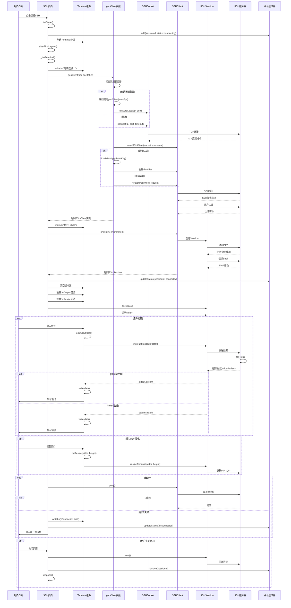

# SSH 连接交互流程时序图

## 完整流程时序图



## 核心组件职责

### 1. **SSHPage** (`lib/view/page/ssh/page/page.dart`)
- 管理SSH连接生命周期
- 处理UI交互
- 管理Terminal组件
- 维护会话状态

### 2. **Terminal** (xterm库)
- 终端显示和渲染
- 处理用户输入
- 管理终端缓冲区
- 支持ANSI转义序列

### 3. **genClient** (`lib/core/utils/server.dart`)
- 创建SSH客户端
- 处理认证逻辑
- 支持跳板服务器
- 管理连接超时

### 4. **SSHClient** (dartssh2库)
- SSH协议实现
- 会话管理
- 数据加密传输
- 认证处理

### 5. **SSHSession** (dartssh2库)
- 管理单个SSH会话
- 处理stdin/stdout/stderr流
- PTY管理
- 命令执行

### 6. **TermSessionManager** (`lib/data/ssh/session_manager.dart`)
- 跟踪活跃SSH会话
- Android前台服务通知
- iOS Live Activities
- 会话状态同步

## 关键流程说明

### 连接建立流程
1. 用户点击连接，创建`SSHPage`实例
2. 调用`genClient`创建SSH客户端
3. 建立TCP连接（直连或通过跳板）
4. SSH协议握手
5. 用户认证（密钥/密码/交互式）
6. 创建Shell会话

### 数据流转机制
```
用户输入 → Terminal.onOutput → SSHSession.write → SSH服务器
SSH服务器 → SSHSession.stdout/stderr → Terminal.write → 屏幕显示
```

### 保活机制
- 每5秒发送ping命令
- 3秒超时检测
- 失败时更新会话状态并提示用户

### 断开处理
- 正常断开：清理资源，移除会话记录
- 异常断开：显示重连对话框，更新会话状态
- 资源清理：关闭连接，释放内存，停止定时器